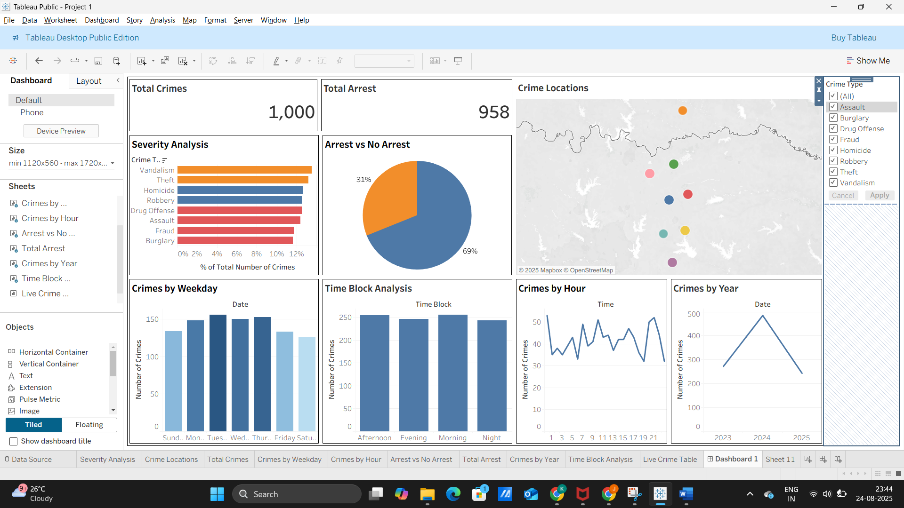

# Crime Analysis Dashboard (Tableau)

An interactive Tableau dashboard that analyzes 1,000 crime records across 8 U.S. cities to show what crimes happen, where, when, and how often they lead to an arrest.



## Objectives
- Show total crimes and total arrests as KPIs
- Identify the most common crime types and their severity
- Map crime locations
- Analyze crimes by weekday, hour, time block and year
- Compare arrests vs. no arrests
- Make it interactive with a Crime Type filter

## Dataset
`data/Crime_Analysis_Dataset.csv` — 1,000 rows, 12 columns:

| Column | Description |
|---|---|
| Crime ID | Unique incident ID |
| Date, Time | When the incident occurred (2023–2025) |
| City, Location | Where it occurred |
| Latitude, Longitude | Coordinates (city level) |
| Crime Type | Assault, Burglary, Drug Offense, Fraud, Homicide, Robbery, Theft, Vandalism |
| Number of Crimes | Count per record |
| Number of Arrests | Arrests made |
| Arrest Made | Arrest Made / No Arrest |
| Severity | Low / Medium / High |

## Calculated fields
- **Time Block** — Morning (6–12), Afternoon (12–18), Evening (18–24), Night (0–6)
- **Rank by Date** — filter used for the Live Crime Table (most recent incidents)

## Dashboard components
Total Crimes KPI · Total Arrests KPI · Crime Locations map · Severity Analysis · Arrest vs No Arrest · Crimes by Weekday · Time Block Analysis · Crimes by Hour · Crimes by Year · Live Crime Table · Crime Type filter

## Key findings
- **1,000** crimes and **958** arrests in total; **69%** of incidents resulted in an arrest, **31%** did not.
- Vandalism (135) and Theft (132) are the most common crime types; Burglary (116) is the least.
- Crimes are fairly even across weekdays, peaking on Tuesday and Thursday and lowest on Saturday.
- Time blocks are nearly even (Morning 256, Afternoon 255, Evening 246, Night 243).
- 2024 had the most crimes (485), vs. 272 in 2023 and 243 in 2025 (2025 may be a partial year).

## Repository structure
```
├── data/         Crime_Analysis_Dataset.csv
├── tableau/      Project_1.twbx  (open in Tableau Desktop / Public)
├── screenshots/  Individual sheet screenshots
├── docs/         Project write-up, requirements, screenshots document
└── README.md
```

## How to use
1. Download `tableau/Project_1.twbx` (the data is packaged inside).
2. Open it in Tableau Desktop or Tableau Public.

## Tools
Tableau Public Desktop Edition, CSV data.
